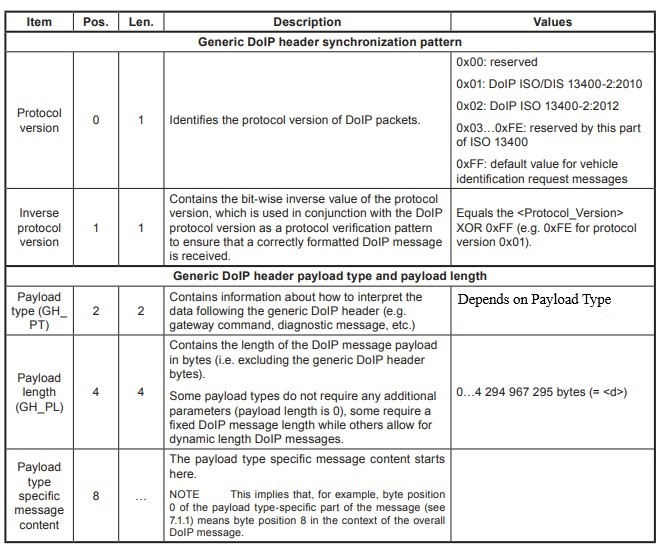
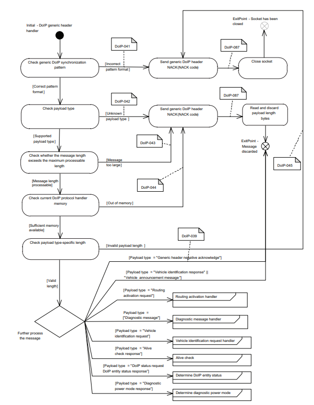
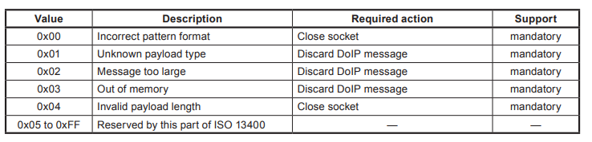
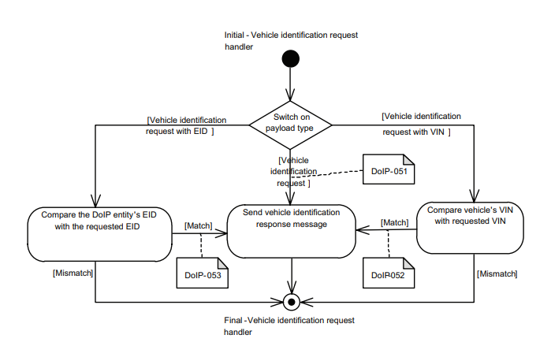
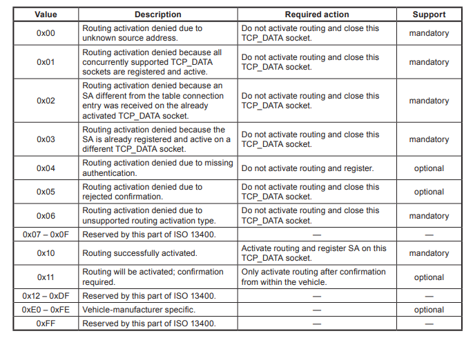
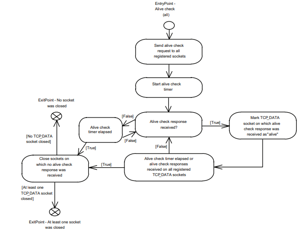
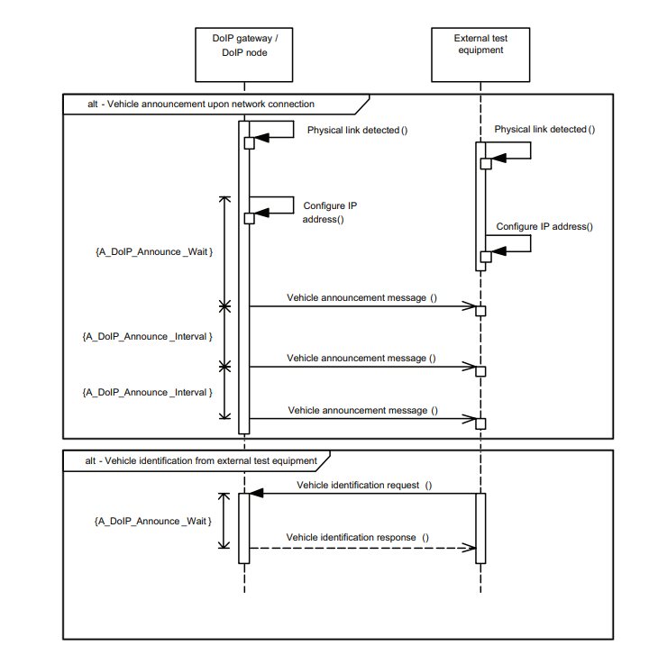
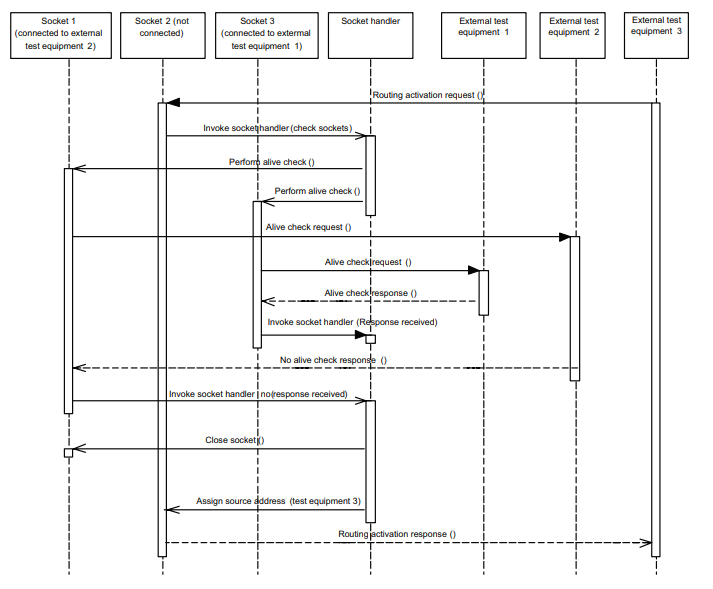
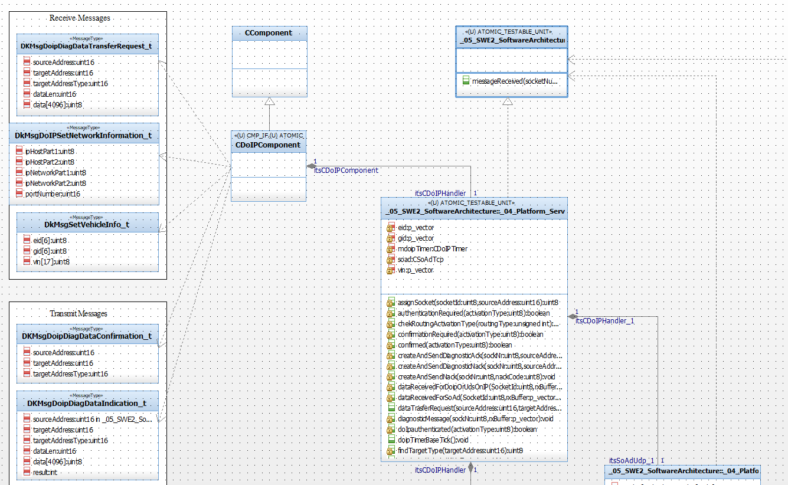
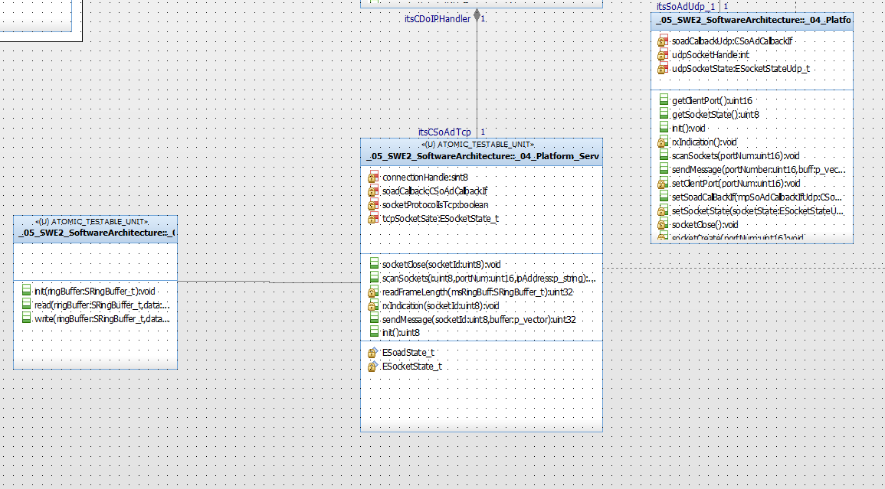

# DOIP Stack

## 1)Introduction
DoIP stands for Diagnostics over Internet Protocol and it facilitates the use of automotive diagnostic services exposed through UDS over TCP/IP on an Ethernet network.
Characterized by ISO 13400-2 standard, DoIP allows for much faster data transfer rates than CAN based diagnostics at a low hardware cost.

### 1.1)Purpose
This document specifies the requirements for diagnostic communication between external test equipment and vehicle electronic components using Internet Protocol (IP) as well as the transmission control protocol (TCP) and user datagram protocol (UDP). 
This includes the definition of vehicle gateway requirements(e.g. for integration into an existing computer network) 
and test equipment requirements (e.g. to detect and establish communication with a vehicle).

### 1.2)Acronyms
| Acronyms    | Description                                     |
| ----------- | ----------------------------------------------  |
| DOIP        | Diagnostic Over Internet Protocol               |
| GIP         | Graphical Interface Processor                   |
| VIP         | Vehicle Interface Processor                     |
| CAN         | Controller Area Network                         |
| IP          | Internet Protocol                               |
| ARP         | Address Resolution Protocol                     |
| MAC         | Media Control Access                            |
| TCP         | Transmission Control Protocol                   |
| VID         | Vehicle IDentification Number                   |
| EID         | Entry IDentification                            |

## 2)Overview of DoIP Stack
DoIP is the set of diagnostic services made available on Ethernet data-frames. It is mostly used in combination of UDS (ISO 14229) based vehicle diagnostics protocol.

### 2.1) DoIP Protocol
DoIP Stack module support  TCP/UDP communication, it is compliance against ISO 13400 Specification.
The DoIP Stack receives the UDS (Diagnostic messages over IP) and decode the UDS message from DoIP frame.
The UDS message will be processed by UDS compoenent. The response from UDS also send to the tester via IP messages.

Supported DOIP messages are:

   1. VehicleAnnouncement
   2. Routing activation
   3. DiagnosticMessages
   4. Alive Check Request/Response

## 3) DoIP on OSI Layer

The application layer services covered by ISO 14229‑5 have been defined in compliance with diagnostic
services established in ISO 14229‑1.

The transport and network layer services covered by the part of ISO 13400-2 have been defined to be independent
of the physical layer implemented.

For other application areas, ISO 13400-3 can be used with any Ethernet physical layer.

Network and Transport Layer is achieved through DoIP Stack here.

### 3.1)Network Layer
Network layer in Doip consists of MAC layer,Internet Protocol(IP),Address Resolution Protocol(ARP),Internet Control Message protocol

#### 3.1.1)MAC Layer
A media access control address (MAC address) is a unique identifier assigned to a network interface controller (NIC) for use as a network address in communications within a network segment.

#### 3.1.2) Internet Protocol
The Internet Protocol (IP) is a protocol, or set of rules, for routing and addressing packets of data so that they can travel across networks and arrive at the correct destination.The first major version of IP, Internet Protocol Version 4 (IPv4), is the dominant protocol of the Internet. Its successor is Internet Protocol Version 6 (IPv6)The main difference between IPv4 and IPv6 is the address size of IP addresses. The IPv4 is a 32-bit address, whereas IPv6 is a 128-bit hexadecimal address. IPv6 provides a large address space, and it contains a simple header as compared to IPv4.
Each DoIP entity shall discard its IP address when the lease of the DHCP-assigned IP address expires,the external test equipment disconnects,a duplicate IP address conflict is detected,the IP address is remotely invalidated.

#### 3.1.3) Address Resolution Protocol
The address resolution protocol (ARP) and the neighbour discovery protocol (NDP) are methods for determining
a host’s hardware (MAC) address when only the host’s IP address is known. They are also used to verify
whether an IP address is in use by another host.

#### 3.1.4) Internet control message protocol
The ICMP is part of the IP suite and is used to send error messages, For e.g.
to indicate that a requested service is not available or that a host could not be reached. Consequently, ICMP
is a mandatory part of an IP stack implementation and is located on the network layer,

### 3.2)Transport Layer
Transport layer consist of Transmission Control Protocol(TCP),User Datagram Protocol(UDP)

#### 3.2.1)Transmission Control Protocol
The Transmission Control Protocol (TCP) is one of the main protocols of the Internet protocol suite. It originated in the initial network implementation in which it complemented the Internet Protocol (IP). Therefore, the entire suite is commonly referred to as TCP/IP. TCP provides reliable, ordered, and error-checked delivery of a stream of octets (bytes) between applications running on hosts communicating via an IP network.
TCP is connection-oriented, and a connection between client and server is established before data can be sent. The server must be listening (passive open) for connection requests from clients before a connection is established. Three-way handshake (active open), retransmission, and error detection adds to reliability but lengthens latency.

#### 3.2.2)User Datagram Protocol
The user datagram protocol (UDP) is a connectionless protocol. UDP does not provide the reliability and ordering guarantees that TCP does. Packets may arrive out of order or may be lost without notification of the sender or receiver. However, UDP is faster and more efficient for many lightweight or time-sensitive purposes.
 
## 4)Technical Description

### 4.1)DoIP Message Structure
All the message which are sent or received contains the generic header which is displayed in Table below

Following shows the DoIP Generic Header Handler

DoIP-039 - Each DoIP entity shall ignore received generic DoIP header negative acknowledge messages

DoIP-041 - Each DoIP entity shall send a generic DoIP header negative acknowledge message with NACK
code set to 0x00 if the protocol version or inverse protocol version (synchronization pattern)
does not match the format

DoIP-042 - Each DoIP entity shall send a generic DoIP header negative acknowledge message with NACK
code set to 0x01 if the payload type is not supported by the DoIP entity

DoIP-043 - Each DoIP entity shall send a generic DoIP header negative acknowledge message with NACK
code set to 0x02 if the payload length exceeds the maximum DoIP message size supported by
the DoIP entity regardless of the current memory utilization.

DoIP-044 - Each DoIP entity shall send a generic DoIP header negative acknowledge message with NACK
code set to 0x03 if the payload length exceeds the currently available DoIP protocol handler
memory of the DoIP entity.

DoIP-045 - Each DoIP entity shall send a generic DoIP header negative acknowledge message with NACK
code set to 0x04 if the payload length parameter does not match the expected length for the
specific payload type. This includes payload-type-specific minimum length, fixed length and
maximum length checks.

Now above mentioned is the Generic Negative Acknowledgement.Each has a unique NACK code based on different scenarios.
DoIP-087 - Each DoIP entity shall perform the required action specified in below Table after having sent the
generic DoIP header negative acknowledge message.

### 4.2)Vehicle identification request message and vehicle announcement
This specifies the requirements to be implemented in order to identify a vehicle or its DoIP entities
in a network. In order for the external test equipment to communicate meaningfully with a DoIP entity, it needs
to know its IP address as well as in which vehicle it is installed. If the IP addresses are known by the external
test equipment, the vehicle identification request can be used to retrieve the VIN/GID and DoIP entities logical
addresses from a specific vehicle. Therefore, the following scenarios are supported:
   1. vehicle with VIN not yet configured (e.g. during assembly phase or after reprogramming.
   2. vehicle with VIN configured and VIN/EID/GID unknown to the external test equipment.
   3. vehicle with VIN configured and VIN/EID/GID known to the external test equipment.
   4. multiple DoIP entities installed on the same vehicle.

DoIP-051 - Each DoIP entity shall send a delayed vehicle identification response message  after receipt of a vehicle
identification request message.

DoIP-052 - Each DoIP entity shall send the vehicle identification response message 
after receipt of a vehicle identification request message with VIN . if the VIN from
the request message matches the DoIP entity’s programmed VIN.

DoIP-053 - Each DoIP entity shall send the vehicle identification response message 
after receipt of a vehicle identification request message with EID . if the EID from
the request message matches the DoIP entity’s programmed EID.

### 4.3)Routing activation request and response
It establishes a route for the DoIP messages and assigns an endpoint Target Address. After successfully establishing a route, diagnostic messages can be exchanged with the target DoIP entity using any diagnostic service.

### 4.4)Diagnostic message and diagnostic message acknowledgement
It specifies the message format that allows for routing of diagnostic messages (i.e. diagnostic
requests) onto the vehicle networks and from the vehicle networks (i.e. diagnostic responses) back to the
external test equipment. If the diagnostic message is sent by the external test equipment, DoIP entities will
always acknowledge (positively or negatively) these messages. Diagnostic messages can also be sent by the
DoIP entities, for example when transmitting a diagnostic response or an unsolicited message (e.g. response
on event) from an ECU to the external test equipment. In this case, the diagnostic messages will not be
acknowledged by the external test equipment.

### 4.5)Alive Check Request/Response
This specifies the message structures of the DoIP messages that are used to determine whether
an open TCP_DATA socket is still in use by external test equipment. The alive check messages are utilized by
the TCP_DATA socket handler. Figure 25 in Clause 11 shows an example sequence of external test
equipment triggering alive check messages while trying to establish a new TCP_DATA socket.
                              

T_TCP_Alive_Check timeout specifies the maximum time that a DoIP entity waits for an alive check response after having written an
alive check request on the TCP_DATA socket. Thus, the timer will also elapse if the underlying TCP stack is unable
to deliver the alive check request message.Its Timeout is 500ms.

## 5.) Message Sequence Chart
Below  depicts the common vehicle announcement and identification sequence between a DoIP gateway or
DoIP node and the external test equipment.

A_DoIP_Announce_Wait is the timing parameter specifies the initial time that a DoIP entity waits until it responds to a vehicle identification request and the time that a DoIP entity waits until it transmits a vehicle announcement message after a valid IP address is configured.
The value of this timing parameter shall be determined randomly between the minimum and the maximum value.

A_DoIP_Announce _Interval is the  timing parameter specifies the time between the vehicle announcement messages that are sent by the DoIP
entities after a valid IP address has been configured.Its delay time is 500ms.

Below sequence followed by the TCP_DATA socket handler, which is handling two concurrent sockets when a third connection is requested with a new routing activation request

## 6.) High Level Design

## 7.) References
1. ISO 13400-2:2012(en)
Road vehicles — Diagnostic communication over Internet Protocol (DoIP) — Part 2: Transport protocol and network layer services
2. https://www.autopi.io/blog/diagnostics-over-internet-protocol-explained/\
3. https://en.everybodywiki.com/Diagnostics_over_IP_(DoIP)
4. https://elearning.vector.com/mod/page/view.php?id=167
5. https://scapy.readthedocs.io/en/latest/api/scapy.contrib.automotive.doip.html