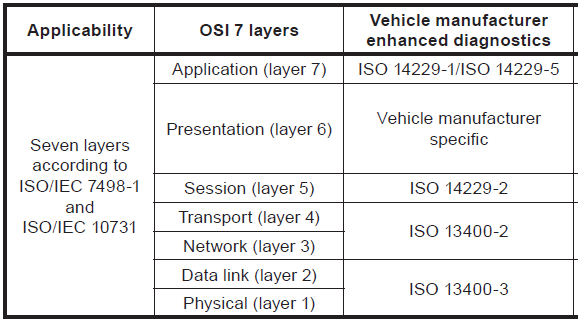
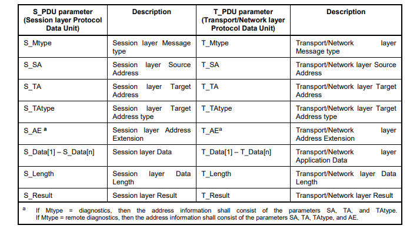
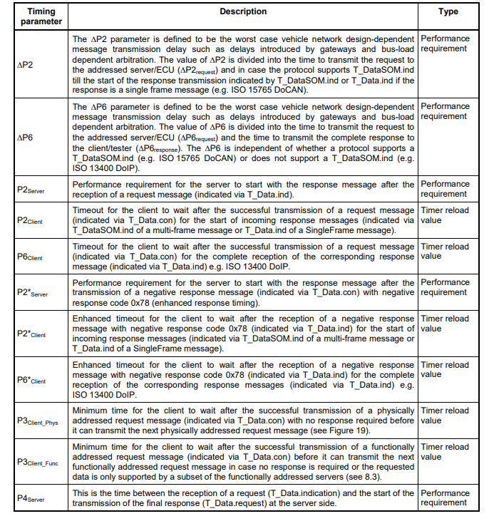
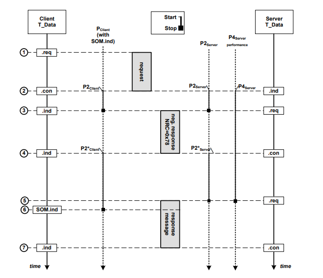
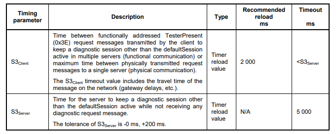
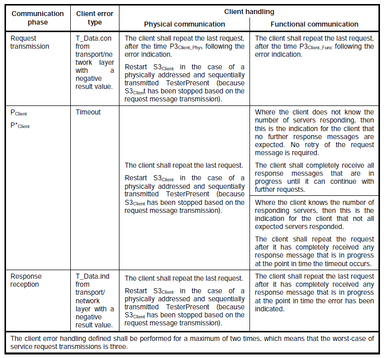
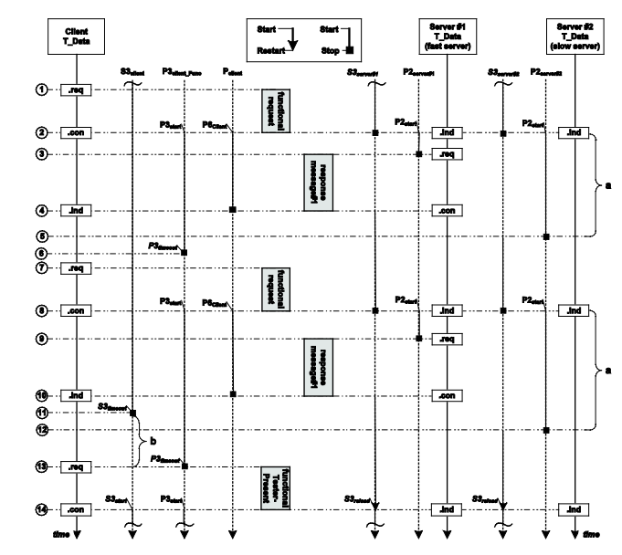
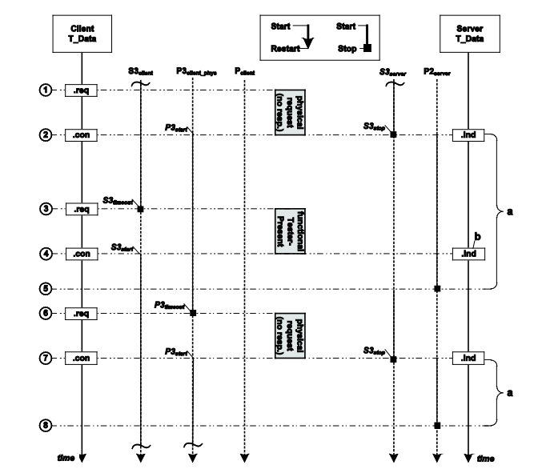
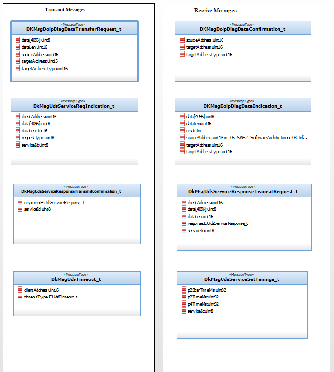
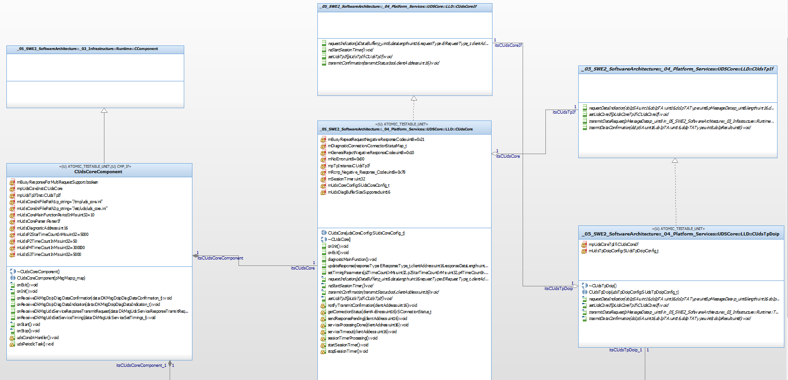

# UDS Core

## 1)Introduction
UDS stands for Unified Diagnostics Services and it facilitates the use of automotive diagnostic services exposed through DOIP over TCP/IP on an Ethernet network.
Characterized by ISO 14229-2 standard and in Session layer.

### 1.1)Purpose
This document specifies the rcommon session layer services to provide independence between unifieddiagnostic services (ISO 14229-1) and all transport protocols and network layer services 

### 1.2)Acronyms
| Acronyms    | Description                                     |
| ----------- | ----------------------------------------------  |
| UDS         | Unified Diagnostics Services                    |
| DOIP        | Diagnostic Over Internet Protocol               |
| GIP         | Graphical Interface Processor                   |
| VIP         | Vehicle Interface Processor                     |
| CAN         | Controller Area Network                         |
| IP          | Internet Protocol                               |

## 2)Overview of UDS Core
The service interface defines a set of services that are needed to access the functions offered by the sessionlayer, i.e. transmission/reception of data and setting of protocol parameters.

### 2.1) UDS Protocol
The UDS protocol is a diagnostic protocol used in Automotive Vehicles to find the cause of a problem for the health check. 
Nowadays the use of the protocol is increasing due to its flexibility.Session layer services (layer 5) specified in this part of ISO 14229-2.

## 3) Session layer services

### 3.1)General
The service interface defines a set of services that are needed to access the functions offered by the session layer, i.e. transmission/reception of data and setting of protocol parameters.All session layer services have the same general structure.
   1. Service request primitive S_Data.request.
   2. Service indicative primitive S_Data.indication.
   3. Service confirmation primitive S_Data.confirm.
   
All session layer services have the same general format. Service primitives are written in the form:
service_name.type   (
                     parameter A,
                     parameter B,
                     parameter C
                     [, parameter X, ...]
                    )

"service_name" is the name of the service (e.g. S_Data),
"type" indicates the type of the service primitive (e.g. request, indication, confirm).
"parameter A, ..." is the S_PDU (Session layer Protocol Data Unit) as a list of values passed by the
service primitive (e.g. addressing information, Data, Length, Result).
"parameter A, parameter B, parameter C" are mandatory parameters that shall be included in all service
calls.
"[parameter X]" is an optional parameter that is included if specific conditions are fulfilled.

For the following communication scenarios needs to be distinguised, physical and function communication during default and non-default session.

### 3.2)Mapping of S_PDU onto T_PDU and vice versa for message transmission
The parameters of the session layer protocol data unit defined to request the transmission of a diagnostic
service request/response are mapped as follows onto the parameters of the transport/network layer protocol
data unit for the transmission of a message in the client/server.

 
## 4)Timing parameter definition

### 4.1)General application timing considerations

#### 4.1.1)Server
A server uses a single application timer (P2Server) implementation which is triggered (started and stopped) by
the T_Data service primitive interface.The P2Server application timer is loaded with a P2Server_max/P2*Server_max parameter value. Both parameters and values are specified in this part of ISO 14229.
The timing parameter P4Server is the time between the reception of a request  and the start of transmission of the final response . A final response is a positive response or a negative response other than negative response code 0x78 "requestCorrectlyReceived-ResponsePending". In case of a request to schedule periodic responses, the initial USDT positive or negative response that indicates the acceptance or non-acceptance of the request to schedule periodic responses shall be considered the final
response. P4Server is a performance requirement. P4Server_max is the maximum value of P4Server. If P4Server_max is the same as P2Server_max, this means that a negative response with negative response code 0x78 is not allowed for that service or data.

#### 4.1.2)Client
A client uses a single application timer (PClient) and it is started whenever the client application layer receives a T_Data.con service primitive. Depending on the protocol type (with T_DataSOM.ind or without T_DataSOM.ind) it is loaded with a
P2Client_max or a P6Client_max parameter value.
For protocols which support T_Data.ind only the client application verifies the correct application timing by comparing its actual PClient application timer with the P6Client_max parameter value. If T_Data.ind is received while PClient is smaller or equal to P6Client_max the timing fulfils the requirements established by this part of
ISO 14229. If no .ind is received while PClient is smaller or equal to P6Client_max an error condition is detected.This shall be flagged to the application layer with the parameters included in the T_Data.ind service primitive.

### 4.2)Application timing parameter definitions – defaultSession
A server shall always start the defaultSession when powered up. If no other diagnostic session is started, thenthe defaultSession shall be run as long as the server is powered.

Each server/ECU shall be able to process a new request message immediately after the successful transmission of a response message (T_Data.con) from the preceding request message

### 4.3)Example for P4Server with/without enhanced response timing
In a scenario, where P4Server = P2Server. In this scenario the server response performance timing parameter indicates that no negative responses including NRC 0x78 are allowed.

In a different scenario where P4Server > P2Server. In this scenario the server response performance timing parameter indicates that negative responses including NRC 0x78 are allowed as long as P4Server is not exceeded.

Client T_Data.req - diagnostic application issues a request message to the transport/network layer.
Server T_Data.ind - transport/network layer issues to diagnostic application the completion of the request message
Client T_Data.con - transport/network layer issues to diagnostic application the confirmation of the completion of the request message. 
Server T_Data.req - diagnostic application does not have the positive response message ready and issues negative response message with NRC = 0x78 by a T_Data.req to transport/network layer within P2Server. Server stops the P2Server timer.
Client T_Data.ind - transport/network layer issues to diagnostic application the reception of a response message. Client stops the
PClient timer.
Server T_Data.con - transport/network layer issues to diagnostic application the completion of the response message. Server starts the P2Server timer using the value of P2*Server = P2*Server_max (default enhanced timing).
Client T_Data.ind - transport/network layer issues to diagnostic application the reception of a response message. Client starts the
PClient timer with the value of P2*Client = P2*Client_max (default enhanced timing).
Server T_Data.req - diagnostic application has prepared the response message and issues a T_Data.req to transport/network layer
within P2Server. Server stops the P2Server timer.
The P4Server performance timer is stopped.
Client T_DataSOM.ind - transport/network layer issues to diagnostic application the reception of a StartOfMessage. Client stops
the PClient timer.

### 4.4)Session timing parameter definitions for the non-default session
When a diagnostic session other than the defaultSession is started, then a session handling is required which
is achieved via the session layer timing parameters
The timing parameter definitions and values as specified in Table 3 and Table 4 are also valid for the nondefault session. Furthermore, the server might change its application layer timings P2Server and P2*Server whentransitioning into a non-default session in order to achieve a certain performance or to compensate restrictions which might apply during a non-default diagnostic session. The applicable timing parameters for a non-default diagnostic session are reported in the DiagnosticSessionControl positive response message in the case where a response is required to be transmitted or have to be known in advance by the client in case no response is required to be transmitted. When the client starts a non-default session functionally, then it shall adapt to the timing parameters of the responding servers.

Above table defines the conditions for the client and the server to start/restart its S3Client/S3Server timer. For the client a periodically transmitted functionally addressed TesterPresent (0x3E) request message shall be distinguished from a sequentially transmitted physically addressed TesterPresent (0x3E) request message, which is only transmitted in case of the absence of any other diagnostic request message. For the server there is no need to distinguish between that kind of TesterPresent (0x3E) handling

### 4.5)Error Handling
Error handling for the application layer and session management to be fulfilled by the client and the server during physical and functional communication shall be in accordance with below table

## 5)Timing handling during communication
There are two types of communication
  1. Physical communication. 
  2. Functional communication.

During various scenarios when its in default session without SOM.ind ,default session with SOM.ind and in default session with enhanced response timing .Physical and functional communication will be treated similarly.

### 5.1)Physical communication during a non-default session
#### 5.1.1)Functionally addressed TesterPresent (0x3E) message
It depicts the timing handling in the client and the server when performing physical communication during a non-default session (e.g. programmingSession) and using a functionally addressed, periodically transmitted TesterPresent (0x3E) request message that does not require a response message
from the server.
The handling of the PClient and P2Server timing is identical to the handling as described in 8.1.2. The only exception is that the reload values on the client side and the resulting time where the server shall send its final response time might differ. This is based on the transition into a session other than the default session where
different PClient timing parameters might apply.

#### 5.1.2)Functionally addressed TesterPresent (0x3E) message
It depicts the timing handling in the client and the server when performing physical communication during a non-default session (e.g. programmingSession) and using a physically addressed TesterPresent (0x3E) request message that requires a response message from the server to keep the
diagnostic session active in case of the absence of any other diagnostic service.

#### 5.1.3)Functional communication during non-default session – with SOM.ind
It depicts the timing handling in the client and two servers for a functionally addressed request message during the non-default session (e.g. programmingSession), where one server requests an enhanced response timing via a negative response message including negative response code 0x78.

### 5.2)Minimum time between client request messages
The minimum time between request messages transmitted by the client is required in order to allow for a
polling driven service data interpretation in the server. Based on normal functionality, a server might process
diagnostic request messages with a design-specific scheduling rate (e.g. 10 ms).

The timing parameter for the minimum time between request messages is divided into the following two timing
parameters.
  1. P3Client_Func: this timing parameter applies to any functionally addressed request message, because it can
be the case that a server is not required to respond to a functionally addressed request message if it does
not support the requested data. 
  2. P3Client_Phys: this timing parameter applies to any physically addressed request message where there is no
response required to be transmitted by the server (suppressPosRspMsgIndicationBit = TRUE).
 

Above illustration tells us about Minimum time between functionally addressed request messages (P3Client_Func)

For the Physical depicts the P3Client_Phys timing handling for the client. The figure shows the handling of a
physically addressed request that does not require a response and of the functionally addressed
TesterPresent (0x3E) request message in the client when S3Client times out. 

## 6)High Level Design

## 7)References
1. ISO 14229-2:2013
Road vehicles — Unified diagnostic services (UDS) — Part 2: Session layer services
2. https://en.wikipedia.org/wiki/Unified_Diagnostic_Services
3. https://piembsystech.com/uds-protocol/
4. https://www.vector.com/in/en/products/solutions/diagnostic-standards/uds-unified-diagnostic-services-iso14229/