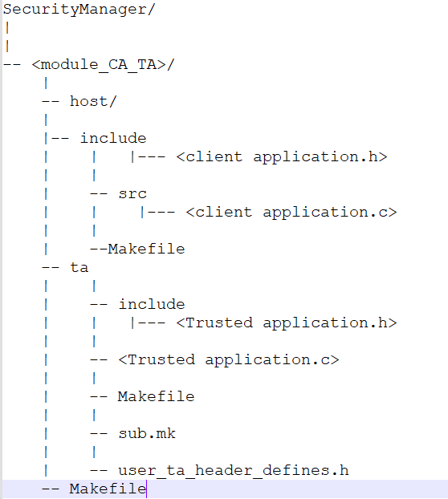

# Content
    1. Prerequiste to Build the OPTEE OS and Client libraries standalone
    2. Building OPTEE OS standalone
    3. Building OPTEE Client standalone
    4. Building CA libraries and TA's from ${PROGRAM}/cluster-platform/dijkstra/libraries/optee-securitylib
    5. OPTEE Security Manager and Client library locations

# Prerequiste to Build the OPTEE OS and Client libraries standalone
    * Download and install latest ti-processor-sdk for linux from https://www.ti.com/tool/PROCESSOR-SDK-AM62X
    * Install the below required tools
    RUN apt update && apt upgrade -y
    RUN apt install -y \
    android-tools-adb \
    android-tools-fastboot \
    autoconf \
    automake \
    bc \
    bison \
    build-essential \
    ccache \
    cpio \
    cscope \
    curl \
    device-tree-compiler \
    expect \
    flex \
    ftp-upload \
    gdisk \
    git \
    iasl \
    libattr1-dev \
    libcap-ng-dev \
    libfdt-dev \
    libftdi-dev \
    libglib2.0-dev \
    libgmp3-dev \
    libhidapi-dev \
    libmpc-dev \
    libncurses5-dev \
    libpixman-1-dev \
    libslirp-dev \
    libssl-dev \
    libtool \
    make \
    mtools \
    netcat \
    ninja-build \
    python-is-python3 \
    python3-crypto \
    python3-cryptography \
    python3-pip \
    python3-pyelftools \
    python3-serial \
    rsync \
    unzip \
    uuid-dev \
    wget \
    xdg-utils \
    xsltproc \
    xterm \
    xz-utils \
    zlib1g-dev

# Building OPTEE OS standalone

    1. Copy the makefile from ${PROGRAM}/cluster-platform/dijkstra/libraries/optee-securitylib/makerules to 
       makerules folder present in ti-processor-sdk for example (ti-processor-sdk-linux-am62xx-evm-10.00.07.04/makerules/Makefile_optee-os).
    2. SET the optee-os source path OPTEE_SRC_DIR=$(TI_SDK_PATH)/board-support/optee-os-4.2.0+git in Rules.make file 
       present in ti-psdk home path (ti-processor-sdk-linux-am62xx-evm-10.00.07.04/Rules.make), ensure exporting the ti-psdk home directory before setting the src directory like this (export TI_SDK_PATH?=/home/vpandia1/ti-processor-sdk-linux-am62xx-evm-10.00.07.04).
    3. Run make optee-os_clean to clean optee-os out.
    4. Run make optee-os to buid the optee-os.
    5. Find the optee-os out under optee-os source directory, replace arm-plat-k3 under ${PROGRAM}/cluster-platform/dijkstra/libraries/optee-securitylib/Prebuilt_OS/ with updated optee-os out

# Building OPTEE Client standalone

    1. Fetch OPTEE client source from git clone https://github.com/OP-TEE/optee_client in ti-psdk home directory.
    2. Copy the makefile from ${PROGRAM}/cluster-platform/dijkstra/libraries/optee-securitylib/makerules to 
       makerules folder present in ti-processor-sdk for example (ti-processor-sdk-linux-am62xx-evm-10.00.07.04/makerules/Makefile_optee-client).
    3. SET the optee-client source path OPTEE_CLIENT_SRC=$(TI_SDK_PATH)/optee_client in Rules.make file 
       present in ti-psdk home path (ti-processor-sdk-linux-am62xx-evm-10.00.07.04/Rules.make), ensure exporting the ti-psdk home directory before setting the src directory like this (export TI_SDK_PATH?=/home/vpandia1/ti-processor-sdk-linux-am62xx-evm-10.00.07.04).
    4. Run make optee-client_clean to clean optee-client out.
    5. Run make optee-client to buid the optee-client.
    6. Find the optee-client out under optee-os source directory, replace out under ${PROGRAM}/cluster-platform/dijkstra/libraries/optee-securitylib/Prebuilt_client/ with updated optee-client out

# Building CA libraries and TA's from ${PROGRAM}/cluster-platform/dijkstra/libraries/optee-securitylib

    1. Add your CA and TA under path ${PROGRAM}/cluster-platform/dijkstra/libraries/optee-securitylib/SecurityManager with _CA_TA appended in directory name , file tree must be like below

    2. Run make optee-securitylib_clean to clean optee-securitylib out.
    3. Run make optee-securitylib to buid the optee-securitylib.
    4. Find the out under optee-securitylib/SecurityManager directory which includes, ca header file, ca static library and ta.
    5. After the above step compile gp-build , which install all optee related libraries and firmware.

Note : To invoke client interface client application header files and static library need to be libteec.a should be include like below in the respective module cmake.

# OPTEE Security Manager and Client library locations
# Set paths to the libraries and includes
    set(OPTEE_SECMGRLIB ${CMAKE_CURRENT_SOURCE_DIR}/../../../libraries/optee-securitylib)
    set(OPTEE_CLIENT_INC ${OPTEE_SECMGRLIB}/Prebuilt_client/out/export/usr)
    set(SECMGR_OUT ${OPTEE_SECMGRLIB}/SecurityManager/out)

# Include directories
    include_directories(
        ${SECMGR_OUT}/include
        ${OPTEE_CLIENT_INC}/include
    )

# Link static libraries
    target_link_libraries(${BINARY_NAME} PRIVATE
        ${SECMGR_OUT}/lib/libopteesecurity.a
        ${OPTEE_CLIENT_INC}/lib/libteec.a
    )

# Procedure to invoke client application interfaces
    1.Before invoking any operation related interface OPTEE session need to be created and opened using below function
        prepare_tee_session_securestorage_crypto(&ctx);
    2.After all the CA operation opened TEE session should be closed using below interface.
        terminate_tee_session_securestorage_crypto(&ctx);
    3. For more detail or for a example refer the test service ${PROGRAM}/cluster-platform/dijkstra/services/optee-security/securitymanager_test/src