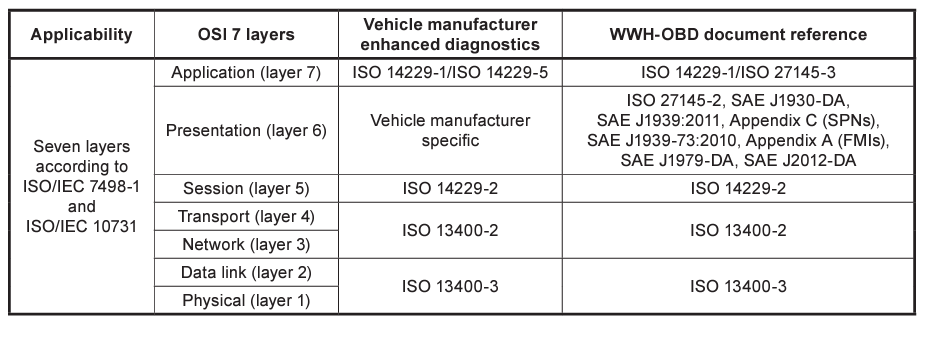
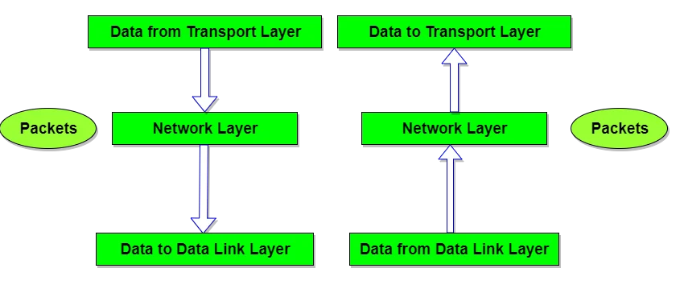
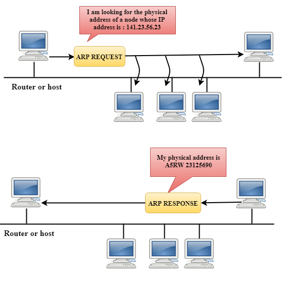
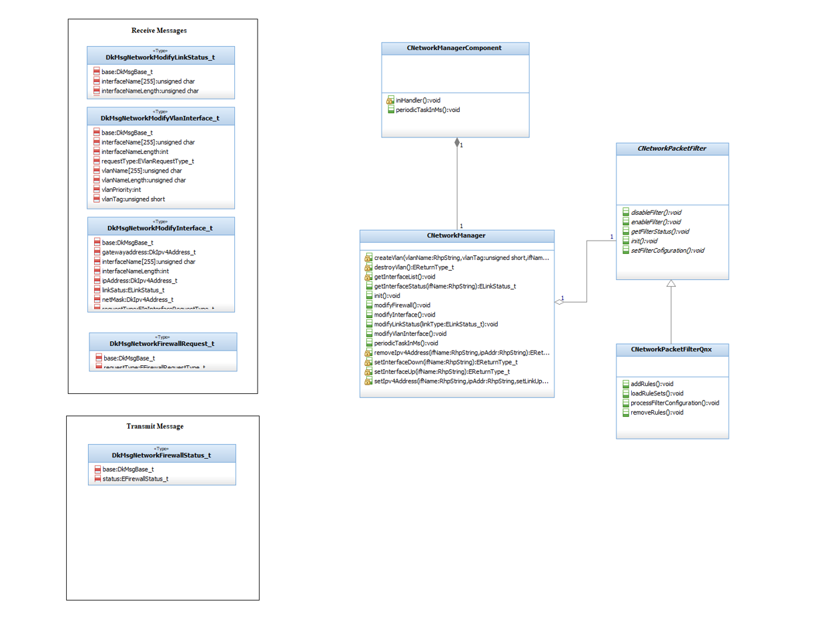

# Network Manager
Handles network traffic, creation and deletion of VLANs Network. 

# 1) Introduction
Network Manager is a system network service that manages your network devices and connections and attempts to keep network connectivity active when available. Network Manager handles network traffic , creation and deletion of VLANs Network.

### 1.1) Purpose
This document specifies the requirements for configuring the following types of connections: Ethernet, wireless, mobile broadband (such as cellular 3G), and DSL and PPPoE(Point-to-Point over Ethernet). In addition Network Manager allows for the configuration of network aliases, static routes, DNS information and VPN connections, as well as many connection-specific parameters. Finally, Network Manager provides a rich API via D-Bus which allows applications to query and control network configuration and state.
This includes the definition of vehicle gateway requirements(e.g. for integration into an existing computer network) and test equipment requirements (e.g. to detect and establish communication with a vehicle).

### 1.2) Acronyms
| Acronyms    | Description                                     |
| ----------- | ----------------------------------------------  |
| VLAN        | Virtual Local Area Network                      |
| IP          | Internet Protocol                               |
| API         | Application Programming Interface               |
| PPPoE       | Point-to-Point over Etherne                     |
| OSI         | Open System Interconnection                     |
| NIC         | Network interface controller                    |
| NDP         | Neighbour discovery protocol                    |

## 2) Overview of Network 
Network layer is the third layer in the OSI model of computer networks. It's main function is to transfer network packets from the source to the destination. It is involved both at the source host and the destination host. At the source, it accepts a packet from the transport layer, encapsulates it in a datagram and then deliver the packet to the data link layer so that it can further be sent to the receiver. At the destination, the datagram is decapsulated, the packet is extracted and delivered to the corresponding transport layer. 

### 2.1) Network Layer
The network layer works for the transmission of data from one host to the other located in different networks. It also takes care of packet routing i.e. selection of the shortest path to transmit the packet, from the number of routes available. The sender & receiver’s IP addresses are placed in the header by the network layer. 

The functions of the Network layer are :  

     Routing: The network layer protocols determine which route is suitable from source to destination. This function of the network layer is known as routing.

     Logical Addressing: In order to identify each device on internetwork uniquely, the network layer defines an addressing scheme. The sender & receiver’s IP addresses are placed in the header by the network layer. Such an address distinguishes each device uniquely and universally.

## 3) Network layer services

Network layer consists of MAC layer, Internet Protocol(IP), Address Resolution Protocol(ARP), Internet Control Message protocol.

#### 3.1) MAC Layer
A media access control address (MAC address) is a unique identifier assigned to a network interface controller (NIC) for use as a network address in communications within a network segment.

#### 3.2) Internet Protocol
The Internet Protocol (IP) is a protocol, or set of rules, for routing and addressing packets of data so that they can travel across networks and arrive at the correct destination.The first major version of IP, Internet Protocol Version 4 (IPv4), is the dominant protocol of the Internet. Its successor is Internet Protocol Version 6 (IPv6)The main difference between IPv4 and IPv6 is the address size of IP addresses. The IPv4 is a 32-bit address, whereas IPv6 is a 128-bit hexadecimal address. IPv6 provides a large address space, and it contains a simple header as compared to IPv4.
Each DoIP entity shall discard its IP address when the lease of the DHCP-assigned IP address expires,the external test equipment disconnects,a duplicate IP address conflict is detected,the IP address is remotely invalidated.

#### 3.3) Address Resolution Protocol
The address resolution protocol (ARP) and the neighbour discovery protocol (NDP) are methods for determining a host’s hardware (MAC) address when only the host’s IP address is known. They are also used to verify whether an IP address is in use by another host.

#### 3.4) Internet control message protocol
The ICMP is part of the IP suite and is used to send error messages, For e.g. to indicate that a requested service is not available or that a host could not be reached. Consequently, ICMP is a mandatory part of an IP stack implementation and is located on the network layer.

## 4) Overview of Network manager

Network Manager performs the network tasks such as detecting an interface, setting the IP address, creating and destroying VLANs etc.

## CNetworkManager class. 
The Network manager is provides the interface for configuration of the network interfaces. It is responsible for
     -# Enable / Disable an Ethernet interface
     -# IP configuration for the interface link.
     -# Enable /disable the IP connections.
     -# Network monitoring and failure detection
     -# Create and destroy VLAN connections.
     -# Set-up firewall policy.

#### 4.1) Network Firewall Configuration using pfctl utility

Network Firewall policy configuration is based on network type, such as public or private, and can be set up with security rules that block or allow access to prevent potential attacks from hackers or malware. Proper firewall configuration is essential, as default features may not provide maximum protection against a cyberattack.
The pfctl utility communicates with the packet filter device using the ioctl interface. It allows ruleset and parameter configuration, and retrieval of status information from the packet filter. Packet filtering restricts the types of packets that pass through network interfaces, entering or leaving the host based on filter rules as described in pf.conf. The packet filter can also replace addresses and ports of packets.

The packet filter is disabled by default. Should pfctl be unable to load a ruleset, an error occurs and the original ruleset remains in place.

[Firewall]
FirewallConfig = /system/etc/pf.conf
EnableFirewall = true

#### 4.2) Cable quality & fault status

This reads the cable quality and specify whether there is fault or not.

void CNetworkPhyEnet::readCableQuality( )
{
lNetworkMsg.FaultStatus = FaultStatusType_NOK;
lNetworkMsg.Fault = FaultType_NoFaultDetected;

}

#### 4.3) NIC driver

The NIC allows computers to communicate over a computer network, either by using cables or wirelessly. The NIC is both a physical layer and data link layer device, as it provides physical access to a networking medium and, for IEEE 802 and similar networks, provides a low-level addressing system through the use of MAC addresses that are uniquely assigned to network interfaces.

[NIC]
NICType = TJA1101

#### 4.4) Enet register requests

Requests network registration status mode.

dk::srvc::platform::NetworkManagerComponent::onReceiveEnetRegReq(dk::runtime::EnetRegReq const&)

## Structure
typedef struct
{
DKMsgBase_t base;
EnetReqCmd_t cmd;
EnetReqMode_t mode;
uint8 dataLen;
data_u8_32 data;
} EnetRegReq;

## 5) APIs used:
| API                             | Description                                                                      | Parameter                           | Return  Type |
| ------------------------------- | -------------------------------------------------------------------------------- | --------------------------------    | -------------|
| oninit()                        | Invoking  Network Manager Initialization method                                  | bool                                |  void        |
| onexit()                        | Network Manager Component onExit Invoked                                         | bool                                |  void        |
| modifyLinkStatus()              | to modify link status                                                            | NetworkModifyLinkStatus             |  void        |
| modifyVlanInterface()           | to modify virtual interface                                                      | NetworkModifyVlanInterface          |  void        |
| modifyFirewall()                | to modify firewall                                                               | EFirewallRequestType_t              |  void        |
| configureInterfaces()           | to configure interface                                                           | void                                |  void        |
| monitorInterfaces()             | to monitor interfaces                                                            | void                                |  void        |
| createVlan()                    | to create virtual LAN                                                            | string,uint16_t,string,uint8_t      |  bool        |
| destroyVlan()                   | to create virtual LAN                                                            | string                              |  bool        |
| notifyInterfaceChanges()        | to notify interface chang                                                        | string,string,ELinkStatus_t         |  void        |
| setInterfaceDown()              | to set interface down                                                            | string                              | void         |
| setInterfaceUp()                | to set interface up                                                              | string                              | void         |

## 6) High Level Design

## 7) Reference

https://cdn.standards.iteh.ai/samples/53766/d029c19b9d65462a8541f6ec9b136a8f/ISO-13400-2-2012.pdf part-2
https://www.ibm.com/docs/en/networkmanager/4.2.0?topic=overview-about-network-manager

