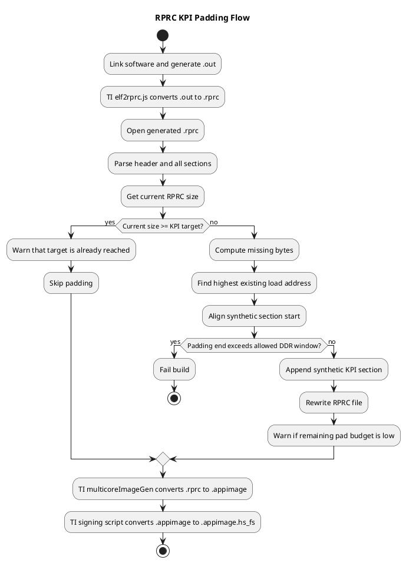

# VP Image Conversion and RPRC KPI Padding

## Purpose

This note explains the VP boot-image generation flow used in this program and the KPI padding logic added on top of it.

The main goal is to understand:

1. what the `*.out` file is
2. what the `*.rprc` file is
3. how `vp_platform.cmake` converts `*.out` into the final signed `*.appimage.hs_fs`
4. what `rprc_kpi_pad.py` changes in that flow
5. what limits must be respected when KPI padding is enabled

This is intended as a practical developer reference, not as a formal specification.

## High-Level Flow

The current build pipeline is:

```text
Link application
    ->
Generate <image>.out
    ->
TI elf2rprc.js
    ->
Generate <image>.rprc
    ->
Optional rprc_kpi_pad.py
    ->
Update <image>.rprc in place
    ->
TI multicoreImageGen
    ->
Generate <image>.appimage
    ->
TI signing script appimage_x509_cert_gen.py
    ->
Generate final <image>.appimage.hs_fs
```

For the current Cupra VP build this becomes:

```text
CUPRA_VP.out
    ->
CUPRA_VP.rprc
    ->
CUPRA_VP.appimage
    ->
CUPRA_VP.appimage.hs_fs
```

## Where This Is Defined

The build flow is driven from:

- [vp_platform.cmake](/home/msavariy/CupraFpk/programs/cupra/my2028/fpk/ti-am62x/vp-build/vp_platform.cmake)

The TI ELF-to-RPRC conversion tool is:

- [elf2rprc.js](/home/msavariy/CupraFpk/programs/cupra/my2028/fpk/ti-am62x/vp-build/HS_FS_Signing_Boot_10_1/out2rprc/elf2rprc.js)

The TI appimage generator is:

- [MulticoreImageGen.c](/home/msavariy/CupraFpk/programs/cupra/my2028/fpk/ti-am62x/vp-build/HS_FS_Signing_Boot_10_1/multicoreImageGen/src/MulticoreImageGen.c)

The KPI padding helper is:

- [rprc_kpi_pad.py](/home/msavariy/CupraFpk/programs/cupra/my2028/fpk/ti-am62x/vp-build/rprc_kpi_pad.py)

## Step 1: What the `*.out` File Is

The `*.out` file is the linked executable image produced by the compiler and linker.

In this project:

- source files are compiled into object files
- the linker script places code and data into memory regions
- the linker emits one final executable file, for example `CUPRA_VP.out`

This `*.out` file contains:

- executable code
- initialized data
- memory addresses for each loadable segment
- program headers and section headers
- debug information, depending on build settings

Important point:

The final boot chain does not directly flash the `*.out` file into NOR. It is an intermediate build artifact. TI image tools convert it into boot-oriented formats.

## Step 2: Why `*.out` Is Converted to `*.rprc`

The raw linked executable is convenient for toolchains and debugging, but boot software wants a simpler load format.

The TI `RPRC` format is used as a compact runtime-program image that lists:

- which loadable ranges exist
- the target load address for each range
- the exact bytes for each range

So `RPRC` is a packaging format derived from the linked executable.

## Step 3: What `RPRC` Means in Practice

From the behavior of [elf2rprc.js](/home/msavariy/CupraFpk/programs/cupra/my2028/fpk/ti-am62x/vp-build/HS_FS_Signing_Boot_10_1/out2rprc/elf2rprc.js), the generated `RPRC` file contains:

1. one file header
2. one section header for each loadable range
3. the actual bytes for each loadable range

The script filters ELF program headers with non-zero `filesz`, sorts them by physical address, and writes them into `RPRC`.

That means:

- initialized, loadable content is kept
- `NOLOAD` or pure `BSS` growth is not enough to enlarge the `RPRC`
- only ranges that carry real bytes in the ELF become RPRC payload

## RPRC Layout

Based on the current TI script, the layout is:

### File Header

The file header is 20 bytes:

```text
Offset  Field
0x00    Magic = "RPRC"
0x04    Entry point
0x08    Reserved
0x0C    Number of sections
0x10    Software version
```

### Section Header

Each section header is also 20 bytes:

```text
Offset  Field
0x00    Load address
0x04    Reserved
0x08    Section size
0x0C    Reserved
0x10    Reserved
```

Immediately after each section header, the section payload bytes are written.

So the serialized structure is:

```text
[RPRC file header]
[section 0 header][section 0 bytes]
[section 1 header][section 1 bytes]
[section 2 header][section 2 bytes]
...
```

## Step 4: How `elf2rprc.js` Creates the `RPRC`

The current TI script does the following:

1. reads the input ELF / `*.out`
2. parses the ELF program headers
3. keeps only ranges where `filesz > 0`
4. sorts ranges by physical address
5. writes the `RPRC` file header
6. writes one section header plus payload for each retained range

Important behavior:

- `rangeSize` is rounded up to a 4-byte boundary
- payload data is copied exactly from the ELF range bytes
- the output `RPRC` name defaults to `<elf_basename>.rprc`

For example:

```text
CUPRA_VP.out -> CUPRA_VP.rprc
```

## Step 5: What `multicoreImageGen` Does

The TI multicore image tool takes one or more `RPRC` files and combines them into a single boot image.

Its job is not to re-link software. Its job is to package already-prepared input images into a bootable aggregate format.

From the current tool source, it writes:

1. a meta-header start block
2. one per-core meta-header block
3. a meta-header end block
4. the actual `RPRC` image bytes

So `appimage` is a wrapper around one or more `RPRC` images with boot metadata.

For VP, the command is currently used with one RPRC image and core id `5`.

## Step 6: What the Signing Step Does

After `appimage` generation, the signing script:

- takes the raw `*.appimage`
- wraps it with TI HS/HS-FS signing metadata and certificate material
- produces the final signed boot artifact

That final signed file is:

```text
<image>.appimage.hs_fs
```

This final signed image is what matters for:

- NOR flashing
- DM firmware authentication
- transfer / copy timing
- actual platform boot behavior

## Why KPI Padding Is Applied on `RPRC`

The KPI goal is to keep the boot image size around a chosen target so that:

- load time from NOR
- authentication time
- copy time into DDR

can be measured against a stable image size.

Padding too late is not useful:

- if bytes are added after signing, they may not be authenticated or loaded the same way
- if bytes are added only in `BSS` or `NOLOAD`, they do not appear in the RPRC payload

So the chosen design is:

- keep the TI ELF-to-RPRC tool unchanged
- modify the generated `RPRC` before `multicoreImageGen`
- let the normal TI image tools carry the extra bytes into the final signed image

## What `rprc_kpi_pad.py` Does

The KPI helper script is a project-owned post-process step.

It does not change the linker output or the TI tools. It changes only the generated `RPRC`.

Its logic is:

1. open the generated `RPRC`
2. validate the `RPRC` header
3. parse every existing section
4. check the current RPRC file size
5. compare current size against the KPI target
6. if already above target, warn and do nothing
7. if below target, compute missing bytes
8. find the highest loadable section end address inside the allowed DDR window
9. align the synthetic section start address to 4 KB
10. create one extra synthetic section with a fixed fill pattern
11. append the synthetic section
12. rewrite the full `RPRC` with the new section count

This means the script is not changing original software sections. It is only adding one extra loadable section at the end of the image.

## What the Synthetic KPI Section Represents

The synthetic section:

- is not used by application logic
- contains only fill bytes
- exists only to stabilize boot-image size for KPI measurement

It is still important because:

- it becomes part of the `RPRC`
- it becomes part of the `appimage`
- it becomes part of the final signed `hs_fs`
- DM firmware then sees a larger authenticated image

## Why `VP_KPI_IMAGE_PAD_MAX_END_ADDR` Exists

The padding section must not be placed at a random address.

The build therefore constrains the synthetic section with:

- `VP_KPI_IMAGE_PAD_MAX_END_ADDR`

This is the exclusive upper limit of the allowed address window for KPI padding.

The script:

- finds the highest existing section end address
- aligns the start upward
- checks that the new padding section still ends below `VP_KPI_IMAGE_PAD_MAX_END_ADDR`

If not, it fails the build instead of silently overlapping another region.

This is a safety mechanism for memory layout.

## Why Slot Size Also Matters

The DDR padding window is not the only constraint.

Even if the synthetic section fits in memory layout terms, the final signed image must still fit in its NOR flash slot.

That means there are two separate limits:

1. load address window limit
2. flash partition size limit

If the final `hs_fs` exceeds the reserved NOR partition size, flashing may still succeed, but the image can overlap the next slot and boot can fail.

So KPI target size must always be chosen with:

- flash slot size
- signing overhead
- appimage overhead

in mind.

## Current CMake Integration

In the current Cupra VP build, the KPI hook is enabled only when:

- `VP_ENABLE_KPI_IMAGE_PADDING` is `ON`

When enabled, `vp_platform.cmake` adds this extra step:

```text
elf2rprc.js
    ->
rprc_kpi_pad.py
    ->
multicoreImageGen
    ->
appimage_x509_cert_gen.py
```

When disabled, the normal TI flow remains unchanged.

## Why Software Growth Does Not Stop

KPI padding does not prevent software growth.

The real behavior is:

- if real image is smaller than target, the synthetic pad fills the gap
- as software grows, synthetic pad shrinks
- once software reaches or exceeds target, padding becomes zero
- after that, final image grows naturally again

So the feature only stabilizes image size temporarily while the real image remains below the configured target.

## Warning Behavior

The script now supports warning thresholds so integrators can see when the KPI target is becoming too small for the growing software image.

Warnings are emitted when:

1. the real RPRC size already meets or exceeds the target
2. the remaining padding budget drops below a configured warning margin

This helps teams revisit:

- `VP_KPI_IMAGE_TARGET_SIZE`
- flash-slot planning
- long-term image growth assumptions

## Common Failure Cases

### 1. RPRC Path Is Wrong

The TI script writes the `RPRC` in the current build directory using the ELF basename.

If CMake points the padding script to the wrong path, the build fails with:

```text
RPRC file not found
```

### 2. KPI Step Was Defined But Not Used

If `KPI_RPRC_PAD_COMMAND` is declared but not inserted into `GenerateHsFs`, image size will never change.

### 3. CMake Cache Still Uses Old Option Value

Changing the `option(... OFF)` default is not always enough if the build directory is reused. A clean reconfigure is needed.

### 4. KPI Target Is Too High for Flash Slot

Even if build succeeds, the final signed `hs_fs` may exceed the reserved NOR partition size and break boot.

### 5. Allowed DDR Padding Window Is Too Small

If the real image grows too much, the synthetic section may no longer fit below `VP_KPI_IMAGE_PAD_MAX_END_ADDR`, and the script intentionally fails.

## Simple Mental Model

If you want a short mental model, use this:

```text
OUT = linked software image
RPRC = loadable TI runtime image made from real ELF payloads
APPIMAGE = boot container around one or more RPRC images
HS_FS = signed final boot image for flashing
KPI padding = one extra synthetic RPRC section added before appimage generation
```

## PlantUML Activity Diagram



## Summary

The important idea is:

- `vp_platform.cmake` already had a TI image-generation chain
- `elf2rprc.js` converts the linked executable into a simpler loadable TI format
- `rprc_kpi_pad.py` does not replace TI tools; it adds one extra synthetic loadable section on top of the generated `RPRC`
- this makes the final signed boot image size more stable for KPI measurements
- the final image must still respect both memory-window and flash-slot limits

